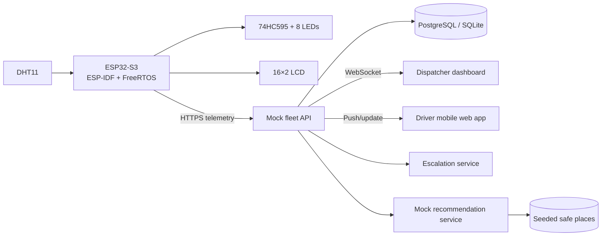
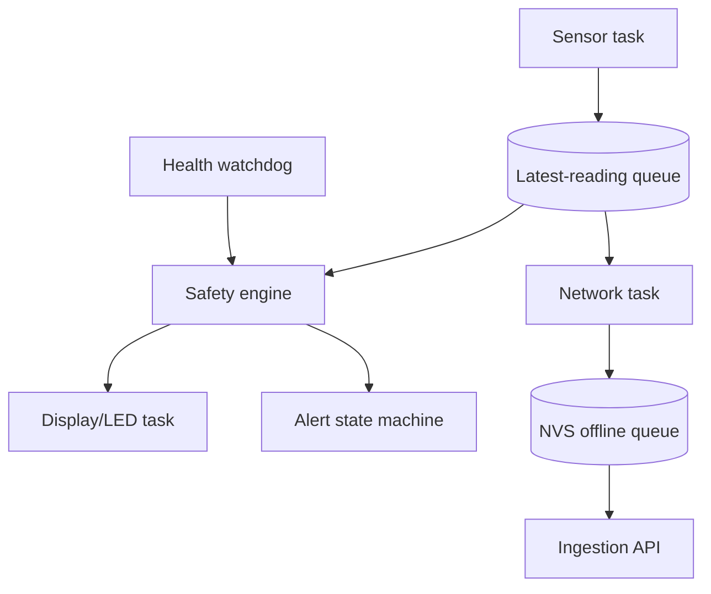
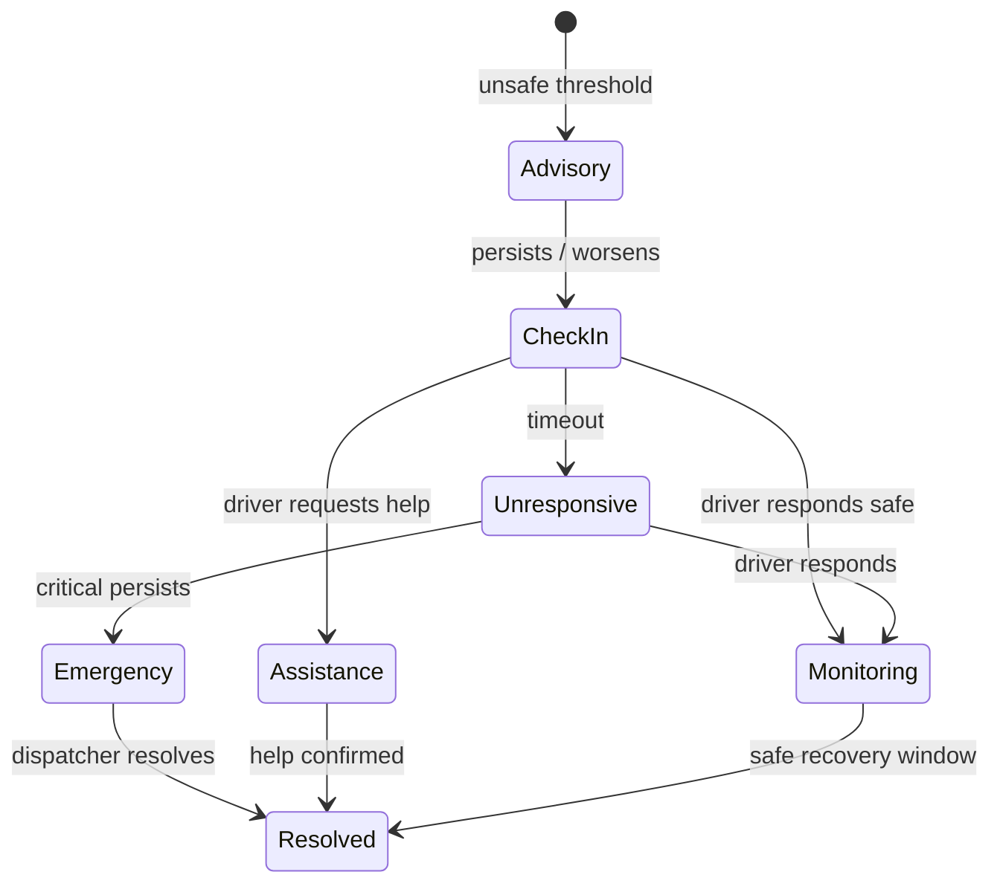

# Fleet Environment Monitoring System

> Real-time fleet technology should protect the person behind the wheel, even when that person is no longer able to clearly communicate that they are in danger.

Fleet Environment Monitoring System is a Samsara-inspired, educational proof of concept for detecting dangerous cabin conditions and helping drivers and dispatchers respond earlier. An ESP32-S3 reads temperature and humidity from a DHT11. The planned system presents an accessible local warning on eight LEDs and a 16×2 LCD, while telemetry feeds a dispatcher dashboard, driver app, mocked fleet API, and location-aware recommendation service.

This repository currently contains the first working firmware increment: an ESP-IDF/FreeRTOS DHT11 reader. The remaining subsystems in this document are the intended architecture, not claims of completed functionality. The prototype is independent and is not affiliated with or endorsed by Samsara.

## Why this exists

Extreme cabin conditions can contribute to heat stress, cold stress, fatigue, dizziness, and disorientation. Those effects can also make detailed screens difficult to interpret and delay a driver's response. This project therefore follows four principles:

- Warn locally, even when Wi-Fi and cloud services fail.
- Make severity understandable at a glance.
- Treat missing sensor data as an operational fault, never as a safe reading.
- Use AI for decision support only; deterministic alerts continue without it.

The system detects environmental risk factors. It does **not** diagnose hyperthermia, heat stroke, hypothermia, or any medical condition, and it does not replace dispatch procedures, emergency judgment, or emergency services.

## Current status

| Capability | Status |
|---|---|
| ESP32-S3 ESP-IDF project | Implemented |
| DHT11 reading every two seconds | Implemented |
| Serial logging and read-error logging | Implemented |
| 74HC595 LED severity bar | Planned |
| 16×2 LCD output | Planned |
| Local classification and escalation | Planned |
| Wi-Fi telemetry and offline queue | Planned |
| Mock API, database, dashboard, and driver app | Planned |
| Recommendation and scenario services | Planned |

Keeping this boundary explicit makes the repository useful as both a working hardware starting point and an honest implementation roadmap.

## System overview



The embedded safety path (sensor → classification → LEDs/LCD) is independent of the network path. A failed upload, dashboard, or AI request must never suppress a local warning.

## Hardware

- ESP32-S3 development board
- Three-pin DHT11 temperature/humidity module
- 74HC595N shift register
- Eight LEDs: two green, two yellow, two orange, two red recommended
- Eight current-limiting resistors (typically 220–330 Ω; calculate for the chosen LEDs)
- HD44780-compatible 16×2 LCD, contrast potentiometer, breadboard, and jumpers
- Stable 3.3 V/5 V supplies appropriate to the selected modules

### Prototype pin plan

The only pin fixed by the current firmware is DHT11 data on **GPIO 5**. The remaining pins are a proposed allocation and must be reconciled with the exact ESP32-S3 board, boot strapping pins, USB/JTAG use, and display voltage levels before wiring.

| Function | Proposed ESP32-S3 pin | Connection |
|---|---:|---|
| DHT11 data | GPIO 5 | Sensor DATA |
| Shift data (DS) | GPIO 15 | 74HC595 pin 14 |
| Shift clock (SHCP) | GPIO 16 | 74HC595 pin 11 |
| Shift latch (STCP) | GPIO 17 | 74HC595 pin 12 |
| LCD RS / E | GPIO 9 / 10 | LCD pins 4 / 6 |
| LCD D4–D7 | GPIO 11–14 | LCD pins 11–14 |

Tie 74HC595 OE low and MR high, add a 0.1 µF decoupling capacitor close to the IC, and connect Q0–Q7 to LEDs through individual resistors. All modules must share ground. See [docs/wiring.md](docs/wiring.md) before assembling.

### LED language

| State | Suggested pattern | Meaning |
|---|---|---|
| Safe | 2 green steady | Normal conditions |
| Caution | 4 LEDs steady | Conditions need attention |
| Heat/cold warning | 6 LEDs steady | Stop and address conditions when safe |
| Critical | All 8 steady | Immediate check-in required |
| Emergency | All 8 flashing | Immediate action/escalation |
| Sensor failure | Alternating `10101010` / `01010101` | Safety data unavailable |

Thresholds belong in one configuration module/menuconfig page rather than being duplicated across tasks.

## Embedded architecture

The target firmware separates time-sensitive local behavior from network behavior:



- **Sensor task:** validates DHT11 values, records monotonic and UTC timestamps, tracks failures and rate of change.
- **Safety engine:** combines temperature, humidity, heat index, unsafe duration, freshness, and acknowledgment state.
- **Output task:** owns LCD and shift-register GPIO and continues without connectivity.
- **Network task:** uses bounded timeouts, exponential backoff with jitter, and a capped persistent queue.
- **Health watchdog:** converts stale readings and component failures into explicit fault states.

A future classification model should distinguish `safe`, `caution`, `heat_warning`, `cold_warning`, `critical`, `emergency`, `sensor_failure`, and `device_offline`. Heat-index calculations and thresholds must be documented and tested; they are screening signals, not diagnoses.

## Firmware setup

Prerequisites: ESP-IDF 5.x, an ESP32-S3 toolchain, USB data cable, and a wired DHT11 module.

```bash
idf.py set-target esp32s3
idf.py menuconfig
idf.py build
idf.py -p /dev/ttyUSB0 flash monitor
```

Change the serial port for the host system. Press `Ctrl+]` to leave the monitor. Expected output is a temperature/humidity reading roughly every two seconds or an explicit DHT11 read failure. Do not place Wi-Fi passwords or API tokens in tracked source; use menuconfig/NVS provisioning and commit only safe defaults.

## Telemetry contract (planned)

```json
{
  "deviceId": "esp32-s3-truck-014",
  "vehicleId": "vehicle-014",
  "temperatureCelsius": 37.8,
  "humidityPercent": 73,
  "heatIndexCelsius": 49.2,
  "riskLevel": "critical",
  "sensorStatus": "online",
  "wifiStatus": "connected",
  "timestamp": "2026-07-14T17:30:00Z"
}
```

The server should validate ranges, authenticate devices, reject malformed timestamps, enforce body/rate limits, and make ingestion idempotent with a device reading ID. The device retries transient failures, retains a bounded local queue, and uploads oldest-first after reconnection.

## Mock fleet API (planned)

The API is a replaceable adapter inspired by common fleet-telematics concepts; it must not use proprietary code or imply an official integration.

| Method | Endpoint | Purpose |
|---|---|---|
| GET | `/api/fleets` | Fleet summary and risk counts |
| GET | `/api/vehicles` | Filterable vehicle list |
| GET | `/api/vehicles/:vehicleId` | Vehicle, device, driver, and latest state |
| GET | `/api/vehicles/:vehicleId/location` | Latest GPS fix |
| GET | `/api/vehicles/:vehicleId/environment` | Environmental history |
| GET | `/api/vehicles/:vehicleId/incidents` | Incident history |
| GET | `/api/drivers` | Driver safety/check-in states |
| POST | `/api/drivers/:driverId/check-in` | Record a driver response |
| GET | `/api/alerts` | Filterable active/history alerts |
| POST | `/api/alerts/:alertId/acknowledge` | Acknowledge an alert |
| POST | `/api/devices/:deviceId/readings` | Ingest telemetry |
| GET | `/api/devices/:deviceId/status` | Health and last communication |

Seed data should cover 25–100 fictional vehicles with deterministic IDs and a mix of normal, dangerous, offline, and sensor-failure states. No real driver personal data should be used.

## Data model and audit trail

Core tables are `fleets`, `vehicles`, `drivers`, `dispatchers`, `devices`, `environmental_readings`, `gps_locations`, `alerts`, `incidents`, `driver_check_ins`, `dispatcher_actions`, `recommendations`, `notification_attempts`, `call_attempts`, `connectivity_events`, and `sensor_errors`.

An incident owns an append-only timeline. Each event records incident ID, event type, actor type/ID, server timestamp, source timestamp, structured payload, and correlation ID. Corrections are new events rather than destructive updates. Retention, access control, encryption, and export policy must be decided before handling production data.

## Dispatcher dashboard (planned)

The operational view includes a live fleet map, severity totals, filterable vehicle/driver list, latest cabin readings, device and sensor health, acknowledgment state, active alerts, escalation level, recommendations, and incident history. Gray means unavailable—not safe. Controls simulate dispatcher messages and calls and always add an audit event.

Suggested filters: safe, check-in required, heat, cold, unacknowledged, offline, and sensor failure. Critical cards show the latest trustworthy location and the reading age prominently.

## Driver mobile experience (planned)

The driver view uses large touch targets, strong contrast, short commands, and no deep navigation during an incident. It shows temperature, humidity, risk, and a recommended action, with responses for:

- I am safe
- I need assistance
- HVAC has failed
- I am stopping now
- Contact me

Primary actions are check in, acknowledge, request assistance, contact dispatch, emergency contact, and navigate to a suggested safe place. Accessibility testing should include color-blind-safe labels, screen readers, outdoor glare, gloves, and high-stress comprehension.

## Alert and check-in flow



Level 1 issues a local warning and notification. Level 2 requires a check-in and alerts dispatch. Level 3 simulates repeat push/SMS/call attempts after no response. Level 4 marks the incident emergency and instructs a dispatcher to apply organizational emergency procedures. Timer values are configurable and use server-side state so app refreshes cannot reset them.

## AI and nearby-place recommendations (planned)

The initial service is deterministic and uses seeded fictional locations: truck stops, cooling centers, heated public buildings, service facilities, rest areas, urgent care, hospitals, and fire stations. It ranks options by risk suitability, distance/ETA, open status, route safety, and vehicle constraints. A provider interface can later accept real maps/places and language-model adapters.

Recommendations must identify their data freshness and never block an alert. They assist a dispatcher; they are not guaranteed medical, navigation, or emergency advice. When the service fails, the UI falls back to direct steps such as stopping safely, contacting dispatch, and using established emergency procedures.

## Demo scenarios

The simulator should replay timestamped telemetry, not bypass business rules:

1. **Normal:** stable readings, green LEDs, no active alert.
2. **Gradual overheating:** rising temperature moves through caution, warning, and critical; dispatch and driver notifications appear.
3. **Critical heat/no response:** check-in expires, LEDs flash, call is simulated, incident reaches emergency.
4. **Cold risk:** falling temperature prompts warming resources and dispatcher contact.
5. **Sensor failure:** invalid/stale readings produce the distinct fault pattern and unavailable-data alert.
6. **Connectivity loss:** local warnings continue, readings queue, dashboard marks the device offline, and queued data synchronizes later.

Detailed acceptance criteria are in [docs/demo-scenarios.md](docs/demo-scenarios.md).

## Proposed repository layout

```text
├── main/                         # Current ESP-IDF application
├── components/                   # Future firmware modules
├── backend/                      # API, WebSocket, services, simulations
├── dispatcher-dashboard/         # React/TypeScript dispatcher UI
├── driver-mobile-app/            # Mobile-first React/TypeScript UI
├── shared/                       # Schemas and shared types
├── docs/                         # Design and demonstration guides
├── sdkconfig.defaults            # Safe firmware defaults
└── README.md
```

Future web setup is expected to use Node.js LTS with `.env.example` files, local SQLite by default, and optional PostgreSQL through Docker Compose. Exact commands should be added only when those applications exist; documenting fictional setup steps would misrepresent the repository.

## Verification plan

- Unit-test threshold boundaries, stale data, unsafe duration, rate of change, acknowledgment, and escalation timers.
- Hardware-test DHT disconnection, corrupted reads, reboot, LED patterns, LCD priority, and prolonged operation.
- Integration-test reading ingestion through WebSocket UI update and audit events.
- Disconnect Wi-Fi/API/AI independently and verify local alerts remain correct.
- Replay all six scenarios with a deterministic clock and assert incident timelines.
- Run accessibility, API authorization, input-validation, and offline-queue capacity tests.

## Screenshots

Add real captures when each interface exists:

- `docs/images/dispatcher-fleet-overview.png`
- `docs/images/dispatcher-critical-incident.png`
- `docs/images/driver-check-in.png`
- `docs/images/hardware-safe-and-emergency.jpg`

Placeholders are intentionally not presented as completed UI.

## Future commercial fleet integration

Keep a `FleetProvider` boundary around vehicles, drivers, locations, routes, and webhook events. A future approved integration would map provider IDs to internal IDs, verify webhook signatures, obey rate limits, request least-privilege scopes, and preserve provider provenance. Legal, privacy, security, and vendor review are prerequisites. Until then, all fleet records and communications remain explicitly mocked.

## Documentation

- [Architecture and reliability](docs/architecture.md)
- [Wiring and bring-up](docs/wiring.md)
- [Demo scenarios](docs/demo-scenarios.md)

## License and safety notice

Add a project license before redistribution. This proof of concept is not a certified safety device, medical device, emergency communications system, or production fleet integration. Do not rely on it to protect life or property. Validate hardware, thresholds, communication paths, operational procedures, security, accessibility, and regulatory obligations with qualified professionals before any real-world use.
